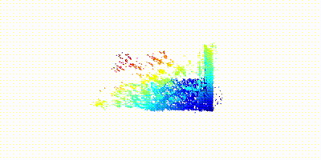

# SFM_OWN

## **ECUST**

*Lab10204 - 3DV Group*

## 效果


## 环境：
### 老版本SURF环境
python 3.7.6  
open3d 0.15.2  
opencv 3.4.2.17  
numpy 1.21.6  
networkx 2.5.1(目前搭建完毕但是还没用上)
### lightglue相关新版本环境
torch 2.1.1
torchvision 0.16.1
cuda 12.1
python 3.8.18  
open3d 0.13.0  
numpy 1.24.4  
opencv 4.8.1.78  
networkx 3.1  
lightglue https://cerulean-puffin-0bb.notion.site/LightGlue-f0aa561ce30245e1ad9c26c6c443709e?pvs=4
## 使用：
### SFM
```
python main.py
```
### LightGlue相关
```
cd feature/LightGlue

python -m gluefactory.train sp+lg_homography_test \
--conf gluefactory/configs/superpoint+lightglue_homography.yaml \
data.batch_size=4#用于训练纯二维图片（目前默认从官方的断点出发）

python -m gluefactory.train sp+lg_homography_test \
--conf gluefactory/configs/superpoint+lightglue_megadepth.yaml \
data.batch_size=2#用于训练megadepth格式的带深度的图片（目前默认从官方的断点出发）

python -m gluefactory.eval.megadepth1500 --checkpoint sp+lg_megadepth_test#用于评估，因为我们需要使用个人数据集所以暂时没有用处
```