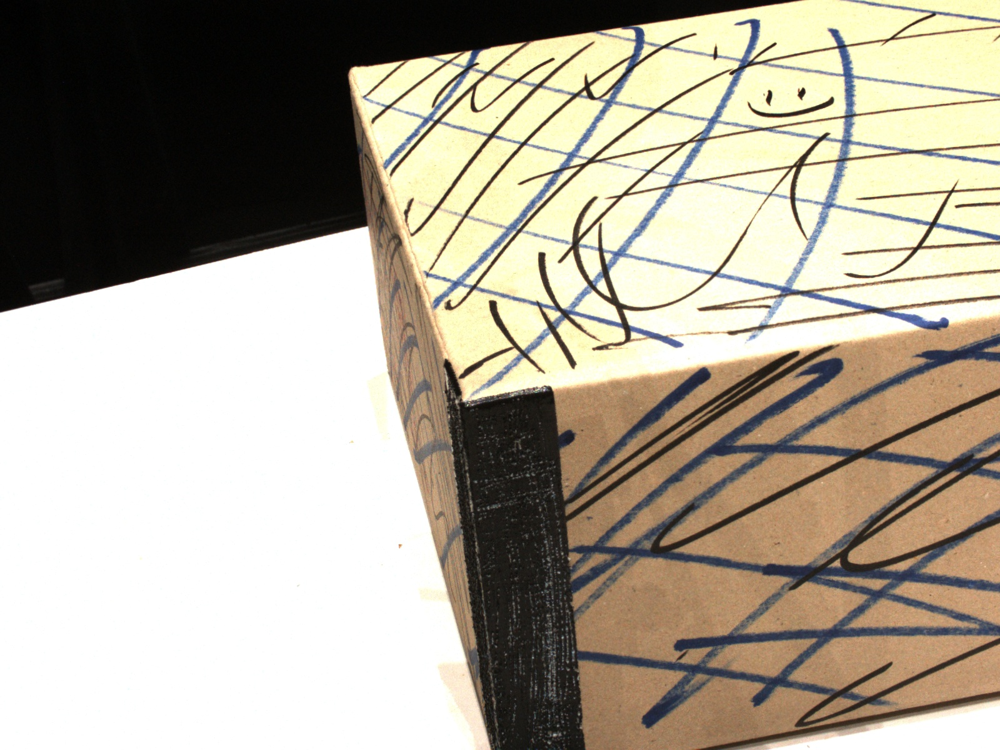
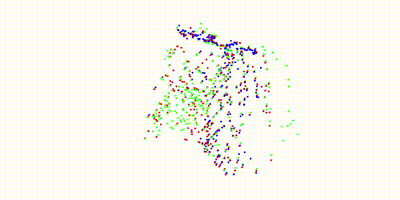

# SFM_OWN

## **ECUST**

*Lab10204 - 3DV Group*

## 效果


## 环境：
python 3.7.6  
open3d 0.15.2  
opencv 3.4.2.17  
numpy 1.21.6  
networkx 2.5.1(目前搭建完毕但是还没用上)  
lightglue https://cerulean-puffin-0bb.notion.site/LightGlue-f0aa561ce30245e1ad9c26c6c443709e?pvs=4  
## 使用：
```
python main.py
```